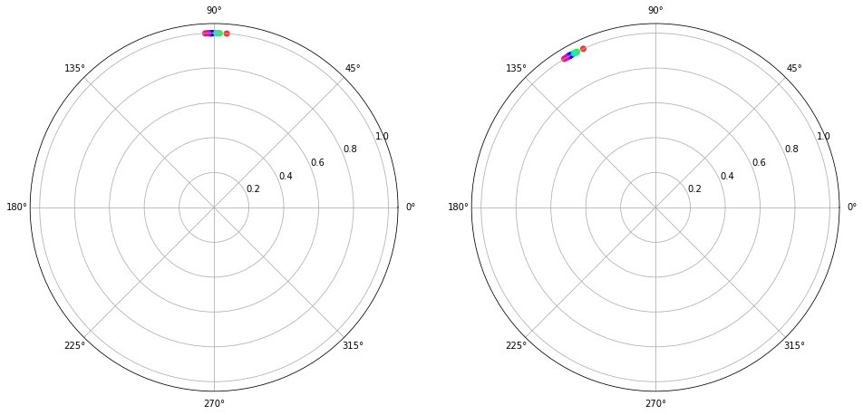

## ArcFace

This notebook is written for summarizing arcFace


**Index**

1. What you should know first
2. Train Configuration
3. Benchmark
4. Parallel Method
5. Reference


### What you should know first

- [ ] ResNet
- [x] ArcFace
- [ ] DataParallel
- [ ] Torch.Distributed


#### Resnet

Resnet50, 100 을 이용해서 구현했기 때문에 


#### ArcFace

ArcFace란 기존의 두 벡터간에 이루고 있는 각도를 더 넓게 벌리는 방법을 사용해서 Intra-class Similarity를 높인다.




#### DataParallel

- [pytorch distributed overview](https://pytorch.org/tutorials/beginner/dist_overview.html) is good start point


There are 3 categories.

- Distributed Data-Parallel Training(DDP) : single program, multiple data
- RPC-Based Distributed Training(RPC) : control for remote machine
- Collective Communication(c10d) : more low level control


There are development common trajectory

1. Use single-device training, if the data and model can fit in one GPU
2. Use single-machine multi-GPU DataParallel, if there are multiple GPUs on server, and you would like to speed up training with the minimum code change
3. Use single-machine multi-GPU DistributedDataParallel, if you would like to further speed up training and willing to write a little more code to set it up


`torch.nn.DataParallel` : single code change, but not that good performance. This copy model to each GPU at forward pass.

```python
device = torch.device('cuda:0')
model = Model()

if torch.cuda.device_count() > 1:
	print("Let's use", torch.cuda.device_count(), 'GPUs!')
	model = nn.DataParallel(model)

model.to(device)
```


`torch.nn.parallel.DistributedDataParallel`

1. create `ProcessGroup` 
2. 


### Train Configuration Code

아래 코드는 [여기](https://github.com/deepinsight/insightface/blob/master/recognition/arcface_torch/configs/ms1mv3_r50.py)서 가지고 왔다. Resnet100버전을 보고 싶었으나 없었다. 하지만 이 세팅을 그대로 가져가도 될 것 같다.

```python
from easydict import EasyDict as edict

# make training faster
# our RAM is 256G
# mount -t tmpfs -o size=140G  tmpfs /train_tmp

config = edict()
config.loss = "arcface"
config.network = "r50"
config.resume = False
config.output = None
config.embedding_size = 512
config.sample_rate = 1.0
config.fp16 = True
config.momentum = 0.9
config.weight_decay = 5e-4
config.batch_size = 128
config.lr = 0.1  # batch size is 512

config.rec = "/train_tmp/ms1m-retinaface-t1"
config.num_classes = 93431
config.num_image = 5179510
config.num_epoch = 25
config.warmup_epoch = -1
config.decay_epoch = [10, 16, 22]
config.val_targets = ["lfw", "cfp_fp", "agedb_30"]
```


### Benchmark

- Train Dataset: MS1V3 (insightFace)
- Test Dataset: LFW, CFP-FP

| Datasets | backbone | IJBC(1e-05) | IJBC(1e-04) | agedb30 | cfp_fp | lfw   |
| -------- | -------- | ----------- | ----------- | ------- | ------ | ----- |
| MS1MV3   | r50      | 94.79       | 96.46       | 98.35   | 98.96  | 99.83 |
| MS1MV3   | r100     | 95.31       | 96.81       | 98.48   | 99.06  | 99.85 |


### Parallel Method

I do nothing about parallel method but in [this page](https://github.com/deepinsight/insightface/tree/master/recognition/arcface_torch#speed-benchmark), partial FC, that is made by [deep insight team](https://github.com/deepinsight), works very faster with more efficiency. 


### Reference

- code reference: [InsightFace repo](https://github.com/deepinsight/insightface/tree/master/recognition/arcface_torch)
- paper reference: [ArcFace: Additive Angular Margin Loss for Deep Face Recognition](https://arxiv.org/abs/1801.07698)


