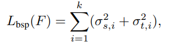
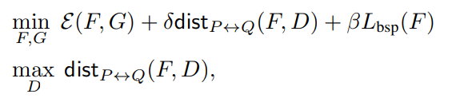
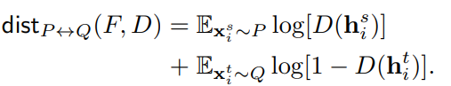
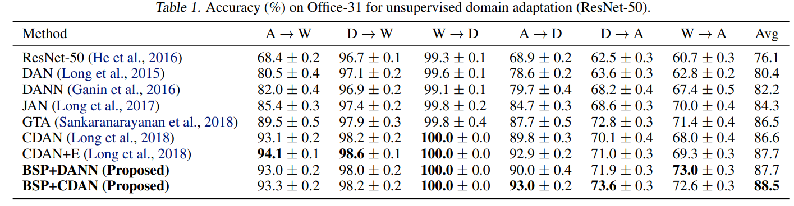

## Domain Adaptation 

Source Domain : 일반 얼굴 이미지 (MS1-MV3)

Target Domain : 마스크 쓴 얼굴 이미지 

Realworld Masked Face Dataset (RMFD) 설명 : 애초에 recognition dataset으로 나왔다.

- subject(525명) 

- without mask (90,000장) : 모든 인물에 대한 평범한 얼굴이 있음.
- with mask (2,203장) : 모든 인물에 대한 모든 마스크 이미지가 있는것은 아님.

Simulating Masked Dataset (WebFace, LFW, CFP-FP)

masked face verification

### BSP (2019)

2번 X, 3.3번 X, 4.3 ~ X

1. BSP의 주요 용어

   - DANN: Domain Adversarial Neural Network 
   - CDAN: Conditional Domain Adversarial Network

2. 요약

   - Adversarial Domain Adaptation : Learning Transferable Representation for knowledge transfer across domain
   - Adversarial Learning : strengthen transferability
   - Problem : discriminability has not fully explored before.
   - approach
     - spectral analysis of the feature representations -> 'deterioration of the discriminability'
     - *Our key finding is that the eigenvectors with the largest singular values will dominate the feature transferbility. As a consequence, the transferability is enhanced at the expense of over penalization of ther eigenvectors that embody rich structures crucial for discriminability*
     - *Towards this problem, we present Batch Spectral Penalization (BSP), a general approach to penalizing the largest singular values so that other eigenvectors can be relatively strengthed to boost the feature discriminability*
   - experiment : *yield state of the art results*

3. 도입

   1. *a domain discriminator is trained to distinguish the source from the target while feature representations are learned to confuse it simultaneously*
   2. singular value decomposition (SVD) to analyze the spectral properties of feature representations in batch

4. Transferability vs Discriminability (reason on discriminability loss)

   1. unsupervised domain adaptation problem : labelled source domain, unlabeled target domain

      Adversarial domain adaptation 중에서 유명한 논문

      1. Ganin at el. (2016) [Domain-adversarial training of neural network paper](https://scholar.google.com/scholar?hl=en&as_sdt=0%2C5&q=Domain-adversarial+training+of+neural+network&btnG=)
      2. Ganin at el. (2015) [Unsupervised domain adaptation by backpropagation paper](http://proceedings.mlr.press/v37/ganin15.html)
      3. Long at el. (2015) [Learning transferable features with deep adaptation networks](http://proceedings.mlr.press/v37/long15)

5. 방법 (how to enhance transferability guaranteeing acceptable discriminability) ()

   eigenvector corresponding to larger singular values should be leveraged for transferability

   eigenvector corresponding to smaller singular values should be leveraged for discriminability

   1. Batch Spectral Penalization (k=1)

      suppress the dimension with top singular value to prevent it from standing out

      > F_s (feature from source), F_t (feature from target) 을 각각 SVD를 적용한다. 적용한 SVD에서 가장 큰 singular value들 중 몇개를 Loss로 사용한다.

      

   2. Domain Adversarial Neural Network에 적용하기 (BSP + DANN)

      Domain Adversarial Neural Network(DANN)에 적용하기 위해서는 기존 DANN에서 사용하는 Classificiation Loss와 Domain Descriptor Loss(내가 맘대로 이름 붙여봄)에 BSP Loss를 추가로 더해줘야한다. 3개의 Loss를 더할 때 각각의 가중치를 포함해서 더해야 한다.

      

      

      3.  Conditional Domain Adversarial Network에 적용하기 (BSP + CDAN)

         Conditional Domain Adversarial Network(CDAN)이란 Domain Descriptor의 인풋으로 그냥 features(F)를 사용하는 것이 아니라 Prediction(F*G) 한 값을 같이 사용하는 것이다. (나도 어떻게 같이사용하는지는 잘 모르겠다 논문을 읽어보자)  따라서 기존의 DANN 방식과 다른점이 있다면 Domain Descriptor Loss를 구하는 과정에서 인풋을 그냥 사용하는것이 아니라 classification의 결과값을 사용해야 한다는 점이다. 하지만 이렇게 되면 circle loss과 겹칠 수 있으니 그냥 사용하지 않는것이 어떨까 싶다...?

         

6. 실험

   1. Dataset

      1. Office-31
      2. Office-Home
      3. VisDA-2017
      4. Digits(MNIST, USPS, SVHN)

   2. Models (Domain Descriptor loss = 1, BSP loss = 0.00001)

      1. DANN
      2. ADDA
      3. CDAN

   3. 결과

      1. Office-31 데이터셋에서의 결과 (A: Amazon, W: Webcam, D: DSLR)

         

      2. Office-Home 데이터셋에서의 결과 (Ar: Artistic images, Cl: Clip Art, Pr: Product images, Rw: Real-World images)

7. 유사 시도

8. 결론

### SHOT (2020)

1. SHOT의 주요 용어
   - UDA: Unsupervised Domain Adaptation

