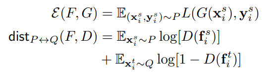
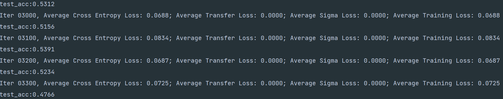

## Domain Adaptation 

Source Domain : 일반 얼굴 이미지 (MS1-MV3)

Target Domain : 마스크 쓴 얼굴 이미지 

Realworld Masked Face Dataset (RMFD) 설명 : 애초에 recognition dataset으로 나왔다.

- subject(525명) 

- without mask (90,000장) : 모든 인물에 대한 평범한 얼굴이 있음.
- with mask (2,203장) : 모든 인물에 대한 모든 마스크 이미지가 있는것은 아님.

Simulating Masked Dataset (WebFace, LFW, CFP-FP)

masked face verification

### BSP (2019)

2번 X, 3.3번 X, 4.3 ~ X

1. BSP의 주요 용어

   - DANN: Domain Adversarial Neural Network 
   - CDAN: Conditional Domain Adversarial Network

2. 요약

   - Adversarial Domain Adaptation : Learning Transferable Representation for knowledge transfer across domain
   - Adversarial Learning : strengthen transferability
   - Problem : discriminability has not fully explored before.
   - approach
     - spectral analysis of the feature representations -> 'deterioration of the discriminability'
     - *Our key finding is that the eigenvectors with the largest singular values will dominate the feature transferbility. As a consequence, the transferability is enhanced at the expense of over penalization of ther eigenvectors that embody rich structures crucial for discriminability*
     - *Towards this problem, we present Batch Spectral Penalization (BSP), a general approach to penalizing the largest singular values so that other eigenvectors can be relatively strengthed to boost the feature discriminability*
   - experiment : *yield state of the art results*

3. 도입

   1. *a domain discriminator is trained to distinguish the source from the target while feature representations are learned to confuse it simultaneously*
   2. singular value decomposition (SVD) to analyze the spectral properties of feature representations in batch

4. Transferability vs Discriminability (reason on discriminability loss)

   1. unsupervised domain adaptation problem : labelled source domain, unlabeled target domain

      Adversarial domain adaptation 중에서 유명한 논문

      1. Ganin at el. (2016) [Domain-adversarial training of neural network paper](https://scholar.google.com/scholar?hl=en&as_sdt=0%2C5&q=Domain-adversarial+training+of+neural+network&btnG=)
      2. Ganin at el. (2015) [Unsupervised domain adaptation by backpropagation paper](http://proceedings.mlr.press/v37/ganin15.html)
      3. Long at el. (2015) [Learning transferable features with deep adaptation networks](http://proceedings.mlr.press/v37/long15)

5. 방법 (how to enhance transferability guaranteeing acceptable discriminability) ()

   eigenvector corresponding to larger singular values should be leveraged for transferability

   eigenvector corresponding to smaller singular values should be leveraged for discriminability

   1. Batch Spectral Penalization (k=1)

      suppress the dimension with top singular value to prevent it from standing out

      > F_s (feature from source), F_t (feature from target) 을 각각 SVD를 적용한다. 적용한 SVD에서 가장 큰 singular value들 중 몇개를 Loss로 사용한다.

      

   2. Domain Adversarial Neural Network에 적용하기 (BSP + DANN)

      Domain Adversarial Neural Network(DANN)에 적용하기 위해서는 기존 DANN에서 사용하는 Classificiation Loss와 Domain Descriptor Loss(내가 맘대로 이름 붙여봄)에 BSP Loss를 추가로 더해줘야한다. 3개의 Loss를 더할 때 각각의 가중치를 포함해서 더해야 한다.

      

      

      3.  Conditional Domain Adversarial Network에 적용하기 (BSP + CDAN)

         Conditional Domain Adversarial Network(CDAN)이란 Domain Descriptor의 인풋으로 그냥 features(F)를 사용하는 것이 아니라 Prediction(F*G) 한 값을 같이 사용하는 것이다. (나도 어떻게 같이사용하는지는 잘 모르겠다 논문을 읽어보자)  따라서 기존의 DANN 방식과 다른점이 있다면 Domain Descriptor Loss를 구하는 과정에서 인풋을 그냥 사용하는것이 아니라 classification의 결과값을 사용해야 한다는 점이다. 하지만 이렇게 되면 circle loss과 겹칠 수 있으니 그냥 사용하지 않는것이 어떨까 싶다...?

         

6. 실험

   1. Dataset

      1. Office-31
      2. Office-Home
      3. VisDA-2017
      4. Digits(MNIST, USPS, SVHN)

   2. Models (Domain Descriptor loss = 1, BSP loss = 0.00001)

      1. DANN
      2. ADDA
      3. CDAN

   3. 결과

      1. Office-31 데이터셋에서의 결과 (A: Amazon, W: Webcam, D: DSLR)

         

      2. Office-Home 데이터셋에서의 결과 (Ar: Artistic images, Cl: Clip Art, Pr: Product images, Rw: Real-World images)

   | 범주      | 카테고리           | 내용                                                         |
   | --------- | ------------------ | ------------------------------------------------------------ |
   | 데이터    | 데이터 전처리      | Office-31 (W(759) -> A(2817), nclass=31), Following ImageNet |
   |           | Train Augmentation | RandomResizedCrop, Horizontal Flip                           |
   |           | Test Augmentation* | Random Crop + Horiontal Flip, 10번(생략)                     |
   | 모델      | 모델 구조*         | ResNet50 (Pre-trained on ImageNet, pytorch version), bottleneck(생략) |
   |           | Regularization     | Nope                                                         |
   | 학습 도구 | Optimizer          | SGD, lr=0.003, weight_decay=0.0005, momentum = 0.95          |
   |           | Criterion          | CLS + 1 * DANN + 0.0001 * BSP                                |
   |           | LR Scheduler*      | 원래 논문과 다르게 했음                                      |
   | 학습      | 에포치*            | 50                                                           |
   |           | 배치 크기          | 36                                                           |
   | 평가      | 평가 방법          |                                                              |

   

7. 유사 시도

8. 결론

### Unsupervised Domain Adaptation (2015)

1. 요약
   - 문제 : Label 정보를 얻기 힘든 상황이 있다.
   - 해결책 : 비슷한 영역의 라벨 데이터를 사용해서 라벨이 없는 데이터를 활용하는 방법을 사용한다.

2. 도입
   - 기존 시도의 문제 : feature가 fixed 된다.
   - 제안 방법 : 기존과는 다르게 source domain에서 학습한 classifier를 가지고 target domain에도 적용할 수 있는 classifier를 만드는 것이 목표이다.

3. 관련 시도 (생략)

4. Deep Domain Adaptation (3.3 제외)

   Source Domain -> Target Domain

   Feature Extractor와 Domain Classfier가 학습하는 Gradient가 다르다. 이것을 위해서 Gradient Reversal Layer(GRL) 이 필요하다. 이 레이어는 Forward시와 Backward시가 다르게 동작하는 레이어이다. 포워드시에는 Identity 매핑을 하고 백워드시에는 음수를 곱하는 레이어이다. 해당 레이어는 기존 파이토치 라이브러리로 쉽게 구현이 가능하다고 한다. 하지만 나는 잘 알지 못하므로 알아봐야 겠다.
   
   
   
5. 실험 (4.0 항목만 정리)

   1. labmda: 논문은 여기서 p 값이 어떤 의미인지 설명하지는 않는다. 그렇다면 p 값을 어떻게 해석해야 할까? 일단 step_size를 max_iter로 나눈 값이라고 이해 했다.

      

   2. 학습이 잘 되었다는 지표는 source domain의 test error가 낮고 domain classifier error가 큰 상황이다.

### Domain Adaptation + Face

Face 영역의 경우 Classifier를 학습에만 사용하고 실제 추론시에는 사용하지 않는다. 왜냐하면 추론시에는 어떤 얼굴이 나올지 알 수 없기 때문이다. 따라서 기존 Domain Adaptaion의 특징 중 하나인 Classifier를 공유한다는 점을 이용 할 수 없다. 

Adaptation Factor와 Target Domain의 Validation Set을 어떻게 정해야 할지 잘 모르겠다.

### SHOT (2020)

1. SHOT의 주요 용어
   - UDA: Unsupervised Domain Adaptation

### BenchMark

내가 Benchmark로 삼은 데이터셋은 Office-31 이다. 각 논문마다 성능이 조금씩 다르게 적혀있어서 내가 읽은 논문 위주로 성능을 정리해봤다. 특히, Office-31에서 W->A(more difficult) , A->W 부분의 DANN, BSP, SHOT 성능을 정리하고자 한다

|             | DANN (2016)  | BSP (2019)    | SHOT (2021)   | In this work (2021)                             |
| ----------- | ------------ | ------------- | ------------- | ----------------------------------------------- |
| source only | 64.2%        | 68.4%         | 68.4%         | **77.8%** (78.125, 77.734, 77.604)         |
| DANN        | 73.0%(+8.8%) | 82.0%(+13.6%) | 82.0%(+13.6%) | **81.5% (+3.7%)** (81.250, 82.031, 81.250) |
| DANN + BSP  | -            | 93%           | -             | **76.1% (-1.7%)** (74.479, 76.563, 77.344) |
| CDAN + BSP  | -            | 93.3%         | 93.0%         | **91.2%** 91.016, 91.406, 91.146)          |
| SHOT        | -            |               | 94.0%         |                                                 |

*표 - Amazon(source), Webcam(target)*

|             | DANN (2016) | BSP (2019) | SHOT (2021) | In this work (2021)                     |
| ----------- | ----------- | ---------- | ----------- | --------------------------------------- |
| source only | -           | 60.7%      | 60.7%       | **65.4%** (65.660, 64.773, 65.767) |
| DANN        | -           | 67.4%      | 67.4%       | **64.4%** (64.489, 64.560, 64.250) |
| DANN + BSP  | -           | 73.0%      | -           |                                         |
| CDAN + BSP  | -           | 72.6%      | 72.6%       | **73.2%** (72.230, 74.609, 72.905) |
| SHOT        | -           | -          | 74.3%       |                                         |

*표 - Webcam(source), Amazon(target)*

### Various Experiment on W -> A

Condition : CDAN + BSP + Entropy, weight_decay + lr scheduler (multi-crop removed)

Condition : CDAN + BSP, weight_decay + lr scheduler (entropy, multi-crop removed)

Condition : DANN + BSP, weight_decay + lr scheduler (entropy, multi-crop removed, DANN instead of CDAN)

안된다... 개빡친다... 아니 애초에 안되는거였다. 물론 Iter 50000 까지 돌리면 될 수도 있겠지만 그건 내 시간이 너무 아깝고 그냥 DANN에서 CDAN으로 갈아타기로 했다.

Condition : Classification Loss Only, weight_decay + lr scheduler (entropy, multi-crop, CDAN, BSP removed)

### Various Experiment on A -> W

Condition : CDAN + BSP, weight_decay + lr scheduler (entropy, multi-crop removed)

Condition : DANN + BSP, weight_decay + lr scheduler (entropy, multi-crop removed, DANN instead of CDAN)

이 친구도 그렇게 좋은 결과는 아니다. 하지만 84% 까지 올라간것을 보면 확실히 학습이되기는 했다.

Condition : Classification Loss Only, weight_decay + lr scheduler (entropy, multi-crop, CDAN, BSP removed)

정리 CDAN + BSP + Entropy + MultiCrop 을 해야 원하는 결과를 얻을 수 있다.

BSP + DANN은 매우 많은 Epoch을 돌려야 결과를 얻을 수 있다.

