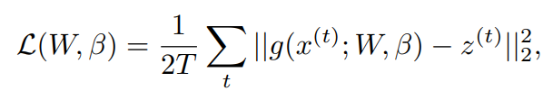
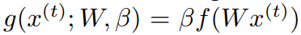
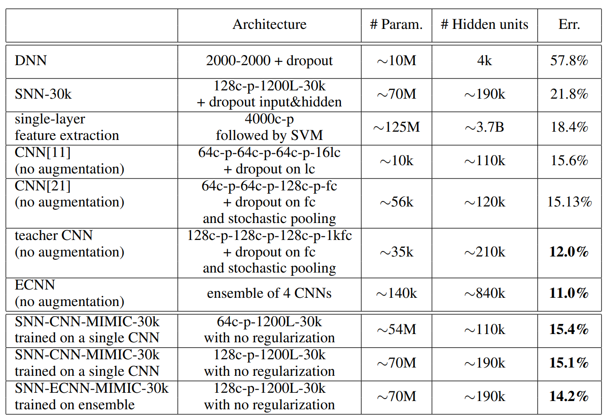

## Do Deep Nets Really Need to be Deep?

Lei Jimmy Ba, 2014

### 요약

발견 : 깊이가 얕은 신경망도 복잡한 함수와 높은 정확도를 달성할 수 있다.

### 1. 도입

문제 : 깊이가 얕은 신경망은 깊은 신경망에 비해 정확도가 떨어진다. 그 이유를 지금 껏 많은 사람들이 증명 해 왔다.

제안 방법 : 깊은 신경망을 한번 학습한 뒤 얖은 신경망이 이를 따라하게 한다. 따라하는 방법은 model compression method를 사용한다.

### 2. Training Shallow Nets to Mimic Deep Nets

학습하는 방법은 Logit Regression을 사용하는 것이다. Teacher model, Student model의 Softmax Layer를 거치지 않고 나온 Logit 값을 Regression 방식으로 학습하는 것이다. 이 식에서 나온 Beta는 fc layer의 weight으로 생각하면 될 것 같다. 주의해야될 점은 Teacher Model을 학습할 때 사용했던 데이터셋은 Student에게 전달 할 수 없다는 것이다. 

### 3. 실험 결과

실험 결과를 보면 Teacher model의 Error Rate가 12%일 때 student model의 Error Rate가 14.2%(-6.7% 감소) 정도 이다. 비록 지금 많이 사용하는 ResNet 기준으로 결과가 리포트된 것은 아니지만 정말로 학습이 된 다는것이 신기했다.

### 4. 결과 분석

그렇다면 왜 이런 학습 방식이 작동을 하는 것일까? 왜 그냥 라벨을 사용해서 학습할 때는 효과가 없던것이 Knowledge Distillation을 사용하니 잘 학습을 할 수 있는 것일까? 그 이유는 Hard Label보다 Teacher model의 Logit 값이 더 유용하기 때문이다.

1. Error가 섞여 있다면 이를 제거할 수 있다.
2. Complex한 부분을 쉽게 배울 수 있다. (사실 나도 이해가 안된다)
3. Hard Label에 비해서 더 많은 정보를 제공한다. Hard Label은 0,1만 제공하는 반면 Logit값은 다른 Class에 대한 정보를 추가로 제공하기 때문에 더 유용하다.
4. (생략)

