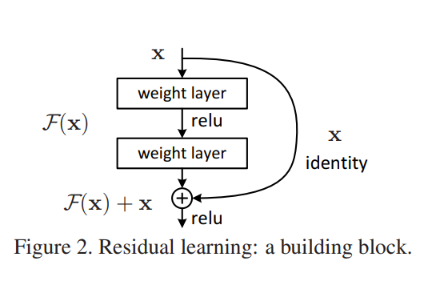
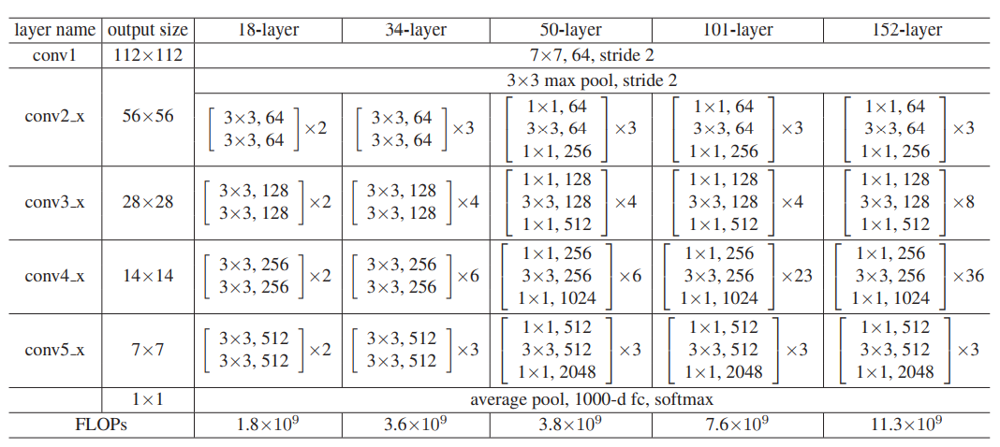
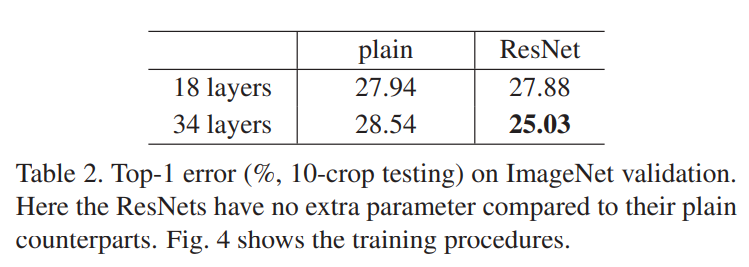
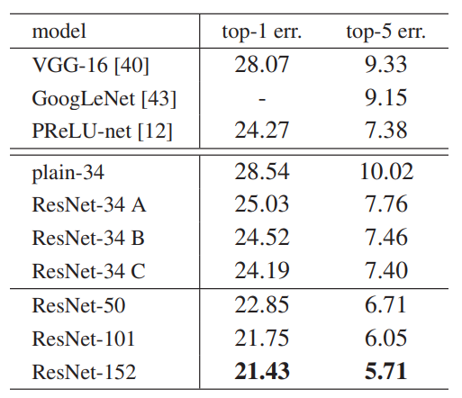
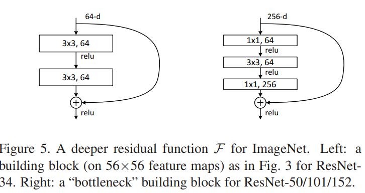

## ResNet

Deep Residual Learning for Image Recognition (2015, kahe@microsoft.com) 논문을 요약하고 실제 구현하고자 한다.

오늘은 문제, 해결법, 디자인 선택지, ImageNet 결과까지 살펴봤다.

내일은 Cifar 결과 확인 + 논문 마무리 + 구현 까지 해볼 예정이다.

### 논문 요약

#### 요약

| 분류   | 내용                                                         |
| ------ | ------------------------------------------------------------ |
| 문제   | Deeper neural networks are more difficult to train           |
| 해결책 | We present a residual learning framework to ease th training of networks that are substantially deeper than those used previously |

#### 또입

배경 : 기존에 있던 Vanishing/Exploding gradients 문제들은 weight initialization으로 해결되었다.

문제 : 길이가 깊은 네트워크에서 Degradation 현상이 발견되었다. Degradation 현상이란 네트워크의 깊이가 깊어질 수록 Training Error가 증가하는 것을 의미한다.

해결책 : shortcut connection을 사용한다.

실험 결과 : 많은 recognition dataset에서 sota를 달성하고 다양한 visual task에서 높은 성능을 달성했다.

#### Deep Residual Learning

Residual Connection은 2개 혹은 3개의(1개는 안된다) Stacked Layer 의 아웃풋에 처음 인풋을 더하는 방법이다. 인풋을 더할 때 그냥 더할 수 있고(1번) square matrix를 거친 뒤에 더할 수 있다.(2번) 결론적으로 말하면 매번 2번 방법을 쓰는 것이 성능은 더 좋았다. 하지만 1번과 2번을 섞어서 사용하는 것이 훨씬더 적은 파라미터로 비슷한 성능을 쓸 수 있기 때문에 (1+2)번 방법을 섞어서 사용하는 것이 기본 Resnet의 구조이다. 

정리하면 (2~3)개의 레이어마다 Skip connection을 더한다. 이 때 아웃풋 feature의 dimension이 달라질 때 2번 connection을 사용하고(zero padding or extra conv layer) 기본으로는 1번 connection을 사용한다.

[구현 세부 사항]

- Data preprocessing & Augmentation

  - 짧은 변을 기준으로 [256, 480] 사이에서 랜덤하게 resize한다.
  - [224, 224] 사이즈로 random crop 한다
  - horizontal flip을 한다.
  - per-pixel mean subtraction을 한다.
  - color augmentation을 한다.

- Regularization

  - Batch Normalization right after each convolution before activation (-> pre BN)
  - no dropout

- Train

  - initialization weights
  - batch_size:256
  - optimizer: SGD (weight decay=0.0001, momentum=0.9)
  - lr = (start from 0.1 divided by 10 when error plateaus) ** 
  - iteration 60 * 10^4

- Testing

  - 10 - crop at multiple scales **

  

#### 실험

모델

실험 결과 1 : plain vs ResNet

실험 결과 2 : Identity vs Projection Shortcuts

최대한 파라미터 수를 줄이기 위해서 2번을 사용하기로 함. 특히 bottleNeck Design에서는 차원의 크기가 크기 때문에 매우 비효율적임

1. zero pad only
2. zero pad + projection shortcut
3. project shortcut only

실험 결과 3 : Bottleneck Architectures

둘 다 성능 향상이 있었으나 훨씬 가볍다는 이유 때문에 ResNet50 이상에서는 BottleNeck 디자인을 사용함

실험 결과 4 : ImageNet SOTA 

single model = 4.49% (top-5 error)

different depth model ensemble = 3.57% (top-5 error)

실험 결과 5 : CIFAR-10 SOTA

