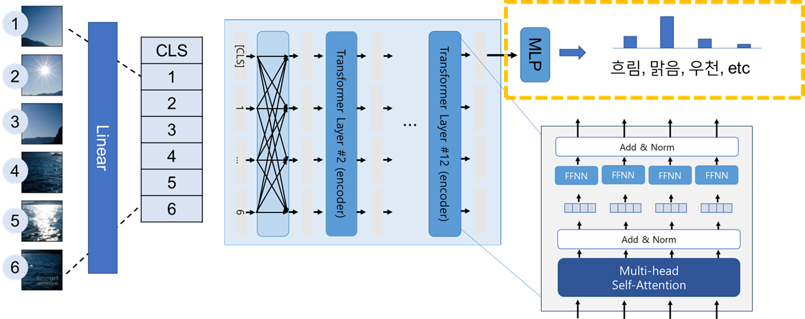
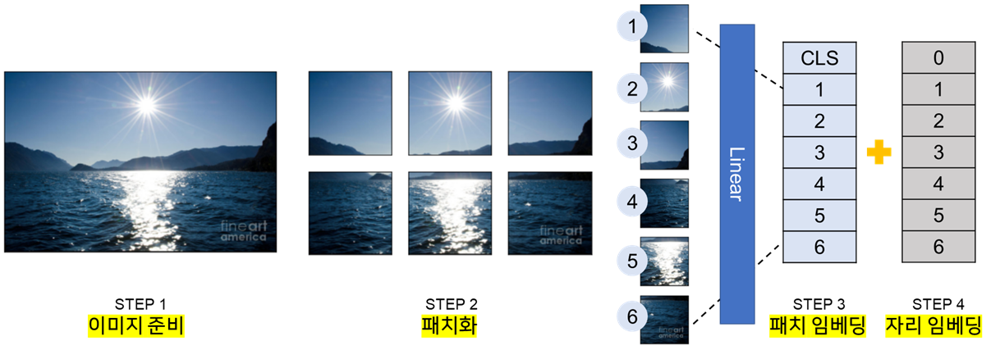
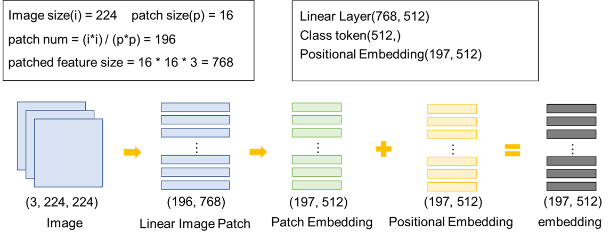
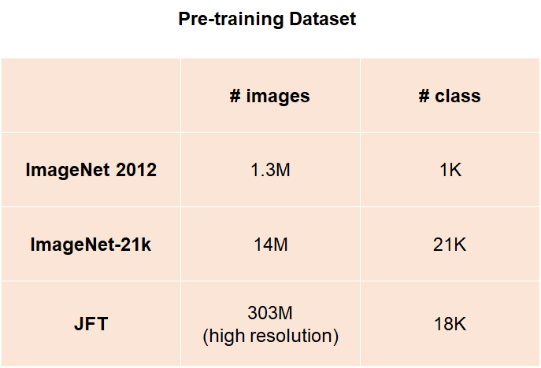
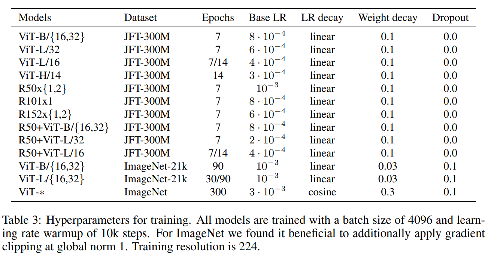
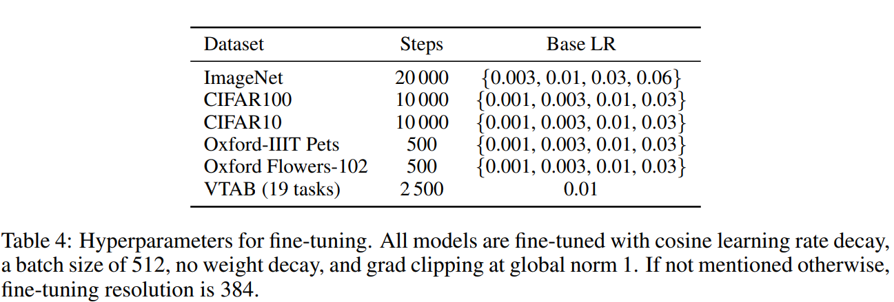
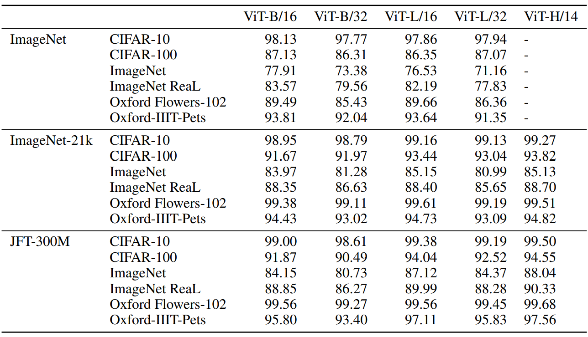

## ViT

Vision Transformer(ViT) 는 기존 Transformer를 Computer Vision 영역에 적용한 사례이다. 해당 [논문](https://arxiv.org/abs/2010.11929)을 읽으면서 중요한 점과 헷갈렸던 점들을 정리하고자 한다.

### 문제정의 (Introduction)

NLP에서 Transformer가 매우 많이 쓰이고 있는 상황이다. 이 Transformer를 Vision 영역에 적용시켜 보는 것이 이 모델의 목표이다.

### 기존 시도

기존에 self-attention을 Vision 영역에 도입하려는 시도가 여러차례 있었다. 하지만 ViT가 SoTA를 달성했고, 달성할 수 있었던 이유는 매우 많은 데이터셋에서 학습할 수 있었기 때문이다. ViT와 연관된 논문을 정리하면 다음과 같다.

| Year | Paper                                                        | Model           |
| ---- | ------------------------------------------------------------ | --------------- |
| 2020 | [Generative Pretraining from Pixels](https://cdn.openai.com/papers/Generative_Pretraining_from_Pixels_V2.pdf) | image GPT(iGPT) |
| 2020 | [One the Relationship between Self-attention and Convolution Layers](https://arxiv.org/abs/1911.03584) |                 |

### 해결책

ViT 모델은 기존에 존재하는 트랜스포머의 구조를그대로 사용한다. 바뀌는 부분은 인풋이 글 대신에 이미지가 들어간다는 점이다. 이미지를 임베딩 벡터로 만든 다음에는 트랜스포머의 인코더 레이어를 여러번 통과시킨다. (트랜스포머를 만약 모르겠다면 [딥러닝을이용한 자연어처리 입문](https://wikidocs.net/35596) 을 참고하자. 아래 그림 또한 책을 참고해서 만들었음)  마지막 레이어의 아웃풋 중에서 CLS 토큰에 해당하는 첫번째 아웃풋을 가지고 예측을 한다.

ViT 모델의 인풋을 만드는 방법은 크게 4단계로 볼 수 있다. 첫번째는 이미지를 준비하는 단계이다. 두번째 단계는 준비한 이미지를 패치화 하는 단계이다. 이 단계에서는 일정한 크기로 전체 이미지를 나눠서 여러개의 패치 이미지를 만든다. 세번째는 만든 패치를 일렬로 만들고 이를 Linear 레이어에 통과시켜서 하나의 패치 임베딩을 만드는 단계이다. 마지막으로는 자리 임베딩을 패치 임베딩과 더해서 최종 인풋 임베딩이 만들어진다.

앞서 설명을 그림으로 나타내면 다음과 같다. 이미지 사이즈를 224, 패치의 크기를 16이라고 했을 때 만들어지는 패치의 개수는 196개이고 하나의 패치를 일렬로 늘이면(3D-> 1D) 768로 늘어난다. 만든 이미지 패치 임베딩(Linear Image Patch)를 가지고 Linear 레이어에 통과 시키면 패치 임베딩이 만들어진다. 만든 패치 임베딩을 가지고 자리 임베딩과 더해주면 인풋으로 사용할 임베딩 벡터가 만들어진다.

### 실험

문제 해결책도 물론 중요하지만 코딩을 하는 입장에서 살펴보면 결과적으로 얼마만큼 성능 개선이 되는지도 매우 중요하다. 성능이 좋지 않으면 이용할 가치가 매우 떨어지기 때문이다. 따라서 어떤 벤치마크에서 어떻게 학습시켜서 어떤 결과가 나왔는지가 매우 매우 매우 중요하다고 할 수 있다. 

모든 실험을 다 정리하면 좋겠지만 너무 많기 때문에 나에게 중요한 실험만 몇가지로 정리하겠다. 나에게 중요한 것은 얼마나 내가 잘 구현했냐와 남들이 학습한 결과를 얼마나 잘 이용할 수 있느냐이다. 이를 바탕으로 정리하면 다음과 같은 실험을 중점적으로 볼 것이다.

- 내가 직접 학습해 볼 수 있는 실험(pre-training 부터 학습 결과 비교까지) : pretrained on ImageNet, evaluate on ImageNet
- 남들이 학습한 모델을 이용해서 fine-tuning 해서 결과 확인하기 : pretrained on JFT, ImageNet 21K, fine-tining on ImageNet, Cifar100, Cifar10

#### Train

**Model** (M=1,000,000)

| Model     | Layers | Hidden size D | MLP size | Heads | Params |
| --------- | ------ | ------------- | -------- | ----- | ------ |
| ViT-Base  | 12     | 768           | 3072     | 12    | 86M    |
| ViT-Large | 24     | 1024          | 4096     | 16    | 307M   |
| ViT-Huge  | 32     | 1280          | 5120     | 16    | 632M   |

**Pre Train**

- FC Layer : two linear layer
- optimizer : Adam(betas=(0.9, 0.999)), weight_decay=0.1
- Loss : CrossEntropy

**Fine Tuning**

- FC Layer : one zero initialized linear layer

- Optimizer : SGD(momentum=0.9)

- Loss : CrossEntropy

#### Evaluate

